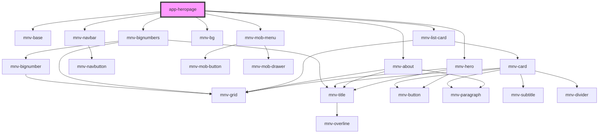

# app-heropage

<!-- Auto Generated Below -->

## Properties

| Property | Attribute | Description | Type           | Default     |
| -------- | --------- | ----------- | -------------- | ----------- |
| `match`  | --        |             | `MatchResults` | `undefined` |

## Dependencies

### Depends on

- [mnv-base](....\layout\mnv-base)
- [mnv-navbar](....\navigation\mnv-navbar)
- [mnv-mob-menu](....\navigation\menu-mobile\mnv-mob-menu)
- [mnv-hero](....\layout\mnv-hero)
- [mnv-bg](....\mnv-bg)
- [mnv-about](....\sections\mnv-about)
- [mnv-list-card](....\mnv-list-card)
- [mnv-bignumbers](....\sections\mnv-bignumbers)

### Graph

---

_Built with [StencilJS](https://stenciljs.com/)_
