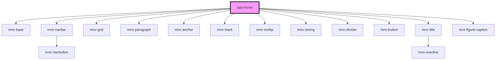

# app-home

<!-- Auto Generated Below -->

## Dependencies

### Depends on

- [mnv-base](..\..\layout\mnv-base)
- [mnv-navbar](..\..\navigation\menu-desktop\mnv-navbar)
- [mnv-grid](..\..\layout\mnv-grid)
- [mnv-paragraph](..\..\typography\mnv-paragraph)
- [mnv-anchor](..\..\typography\mnv-anchor)
- [mnv-mark](..\..\typography\mnv-mark)
- [mnv-tooltip](..\..\layout\mnv-tooltip)
- [mnv-strong](..\..\typography\mnv-strong)
- [mnv-divider](..\..\typography\mnv-divider)
- [mnv-button](..\..\inputs\mnv-button)
- [mnv-title](..\..\typography\mnv-title)
- [mnv-figure-caption](..\..\layout\mnv-figure-caption)

### Graph

----------------------------------------------

*Built with [StencilJS](https://stenciljs.com/)*
