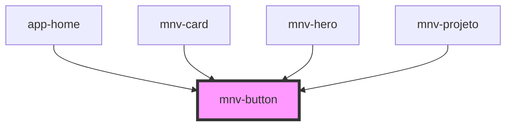

# mnv-button

<!-- Auto Generated Below -->

## Properties

| Property     | Attribute    | Description | Type      | Default    |
| ------------ | ------------ | ----------- | --------- | ---------- |
| `contained`  | `contained`  |             | `boolean` | `false`    |
| `disabled`   | `disabled`   |             | `boolean` | `false`    |
| `full`       | `full`       |             | `boolean` | `false`    |
| `marginzero` | `marginzero` |             | `boolean` | `false`    |
| `outlined`   | `outlined`   |             | `boolean` | `false`    |
| `type`       | `type`       |             | `string`  | `'button'` |

## Dependencies

### Used by

 - [app-home](../../app-pages/app-home)
 - [mnv-card](../../layout/mnv-card)
 - [mnv-hero](../../sections/mnv-hero)
 - [mnv-projeto](../../sections/expositor/mnv-projeto)

### Graph

----------------------------------------------

*Built with [StencilJS](https://stenciljs.com/)*
