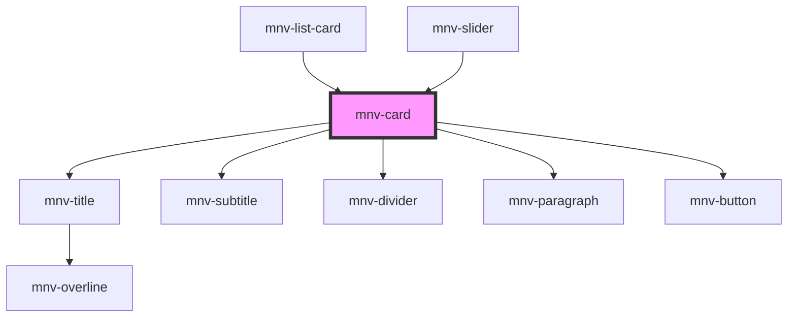

# mnv-card

<!-- Auto Generated Below -->

## Properties

| Property    | Attribute   | Description | Type     | Default               |
| ----------- | ----------- | ----------- | -------- | --------------------- |
| `button`    | `button`    |             | `string` | `undefined`           |
| `cardtitle` | `cardtitle` |             | `any`    | `undefined`           |
| `link`      | `link`      |             | `string` | `'http://google.com'` |
| `overline`  | `overline`  |             | `any`    | `undefined`           |
| `subtitle`  | `subtitle`  |             | `any`    | `undefined`           |
| `width`     | `width`     |             | `number` | `undefined`           |

## Dependencies

### Used by

 - [mnv-list-card](..\..\sections\mnv-list-card)
 - [mnv-slider](..\..\sections\slider\mnv-slider)

### Depends on

- [mnv-title](..\..\typography\mnv-title)
- [mnv-subtitle](..\..\typography\mnv-subtitle)
- [mnv-divider](..\..\typography\mnv-divider)
- [mnv-paragraph](..\..\typography\mnv-paragraph)
- [mnv-button](..\..\inputs\mnv-button)

### Graph

----------------------------------------------

*Built with [StencilJS](https://stenciljs.com/)*
