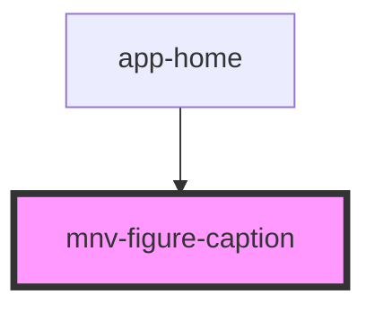

# mnv-figure-caption

<!-- Auto Generated Below -->

## Properties

| Property          | Attribute         | Description | Type      | Default     |
| ----------------- | ----------------- | ----------- | --------- | ----------- |
| `alt`             | `alt`             |             | `string`  | `undefined` |
| `bold`            | `bold`            |             | `boolean` | `undefined` |
| `boldspotlight`   | `boldspotlight`   |             | `boolean` | `undefined` |
| `boldtext`        | `boldtext`        |             | `boolean` | `undefined` |
| `italic`          | `italic`          |             | `boolean` | `undefined` |
| `italicspotlight` | `italicspotlight` |             | `boolean` | `undefined` |
| `italictext`      | `italictext`      |             | `boolean` | `undefined` |
| `src`             | `src`             |             | `string`  | `undefined` |

## Dependencies

### Used by

 - [app-home](..\..\app-pages\app-home)

### Graph

----------------------------------------------

*Built with [StencilJS](https://stenciljs.com/)*
