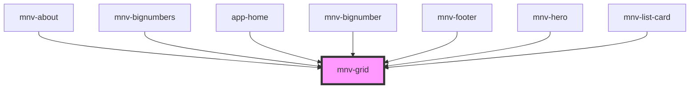

# mnv-grid

<!-- Auto Generated Below -->

## Properties

| Property    | Attribute   | Description | Type      | Default     |
| ----------- | ----------- | ----------- | --------- | ----------- |
| `container` | `container` |             | `boolean` | `undefined` |
| `indented`  | `indented`  |             | `boolean` | `undefined` |
| `item`      | `item`      |             | `boolean` | `undefined` |
| `lg`        | `lg`        |             | `string`  | `undefined` |
| `md`        | `md`        |             | `string`  | `undefined` |
| `sm`        | `sm`        |             | `string`  | `undefined` |
| `spacing`   | `spacing`   |             | `number`  | `undefined` |
| `xl`        | `xl`        |             | `string`  | `undefined` |

## Dependencies

### Used by

- [mnv-about](....\sections\mnv-about)
- [mnv-bignumbers](....\sections\mnv-bignumbers)
- [app-home](....\app-pages\app-home)
- [mnv-bignumber](..\mnv-bignumber)
- [mnv-footer](..\mnv-footer)
- [mnv-hero](..\mnv-hero)
- [mnv-list-card](....\mnv-list-card)

### Graph

---

_Built with [StencilJS](https://stenciljs.com/)_
