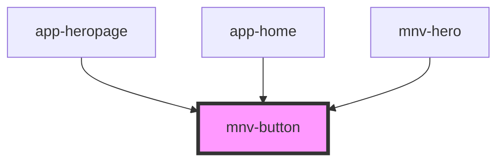

# mnv-button

<!-- Auto Generated Below -->

## Properties

| Property    | Attribute   | Description | Type      | Default    |
| ----------- | ----------- | ----------- | --------- | ---------- |
| `contained` | `contained` |             | `boolean` | `false`    |
| `disabled`  | `disabled`  |             | `boolean` | `false`    |
| `outlined`  | `outlined`  |             | `boolean` | `false`    |
| `type`      | `type`      |             | `string`  | `'button'` |

## Dependencies

### Used by

 - [app-heropage](../app-heropage)
 - [app-home](../app-home)
 - [mnv-hero](../mnv-hero)

### Graph

----------------------------------------------

*Built with [StencilJS](https://stenciljs.com/)*
