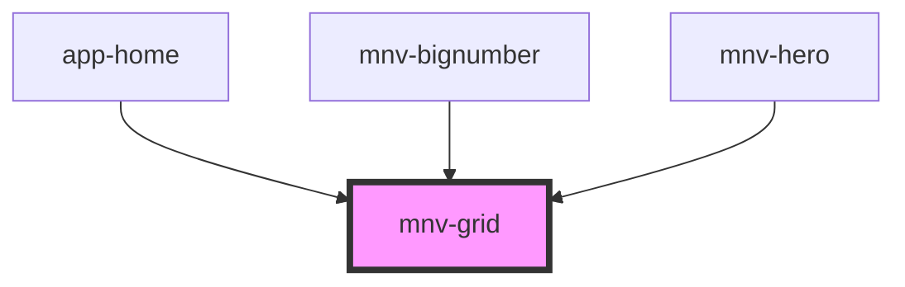

# mnv-grid

<!-- Auto Generated Below -->

## Properties

| Property    | Attribute   | Description | Type      | Default     |
| ----------- | ----------- | ----------- | --------- | ----------- |
| `container` | `container` |             | `boolean` | `undefined` |
| `item`      | `item`      |             | `boolean` | `undefined` |
| `lg`        | `lg`        |             | `string`  | `undefined` |
| `md`        | `md`        |             | `string`  | `undefined` |
| `sm`        | `sm`        |             | `string`  | `undefined` |
| `spacing`   | `spacing`   |             | `number`  | `undefined` |
| `xl`        | `xl`        |             | `string`  | `undefined` |

## Dependencies

### Used by

 - [app-home](../app-home)
 - [mnv-bignumber](../mnv-bignumber)
 - [mnv-hero](../mnv-hero)

### Graph

----------------------------------------------

*Built with [StencilJS](https://stenciljs.com/)*
