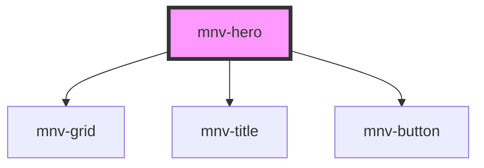

# mnv-hero

<!-- Auto Generated Below -->

## Properties

| Property     | Attribute    | Description | Type     | Default     |
| ------------ | ------------ | ----------- | -------- | ----------- |
| `background` | `background` |             | `string` | `undefined` |
| `button`     | `button`     |             | `string` | `undefined` |
| `name`       | `name`       |             | `string` | `undefined` |

## Dependencies

### Depends on

- [mnv-grid](../mnv-grid)
- [mnv-title](../mnv-title)
- [mnv-button](../mnv-button)

### Graph

----------------------------------------------

*Built with [StencilJS](https://stenciljs.com/)*
