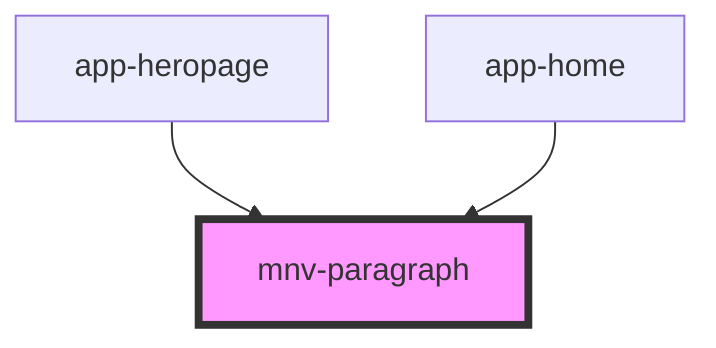

# mnv-paragraph

<!-- Auto Generated Below -->

## Properties

| Property    | Attribute   | Description                                        | Type      | Default     |
| ----------- | ----------- | -------------------------------------------------- | --------- | ----------- |
| `bodytwo`   | `bodytwo`   | Altera o parágrafo para tamanho reduzido (body 2). | `boolean` | `undefined` |
| `capitular` | `capitular` | Ativa ou desativa estilização de capitular.        | `boolean` | `undefined` |

## Dependencies

### Used by

 - [app-heropage](../app-heropage)
 - [app-home](../app-home)

### Graph

----------------------------------------------

*Built with [StencilJS](https://stenciljs.com/)*
