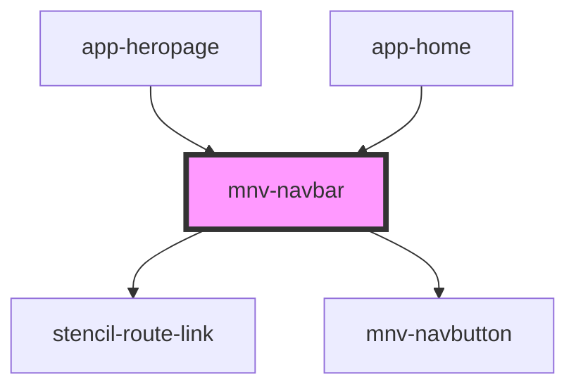

# mnv-navbar

<!-- Auto Generated Below -->

## Properties

| Property   | Attribute   | Description | Type     | Default |
| ---------- | ----------- | ----------- | -------- | ------- |
| `setClass` | `set-class` |             | `string` | `' '`   |

## Dependencies

### Used by

 - [app-heropage](..\..\app-pages\app-heropage)
 - [app-home](..\..\app-pages\app-home)

### Depends on

- stencil-route-link
- [mnv-navbutton](..\mnv-navbutton)

### Graph

----------------------------------------------

*Built with [StencilJS](https://stenciljs.com/)*
