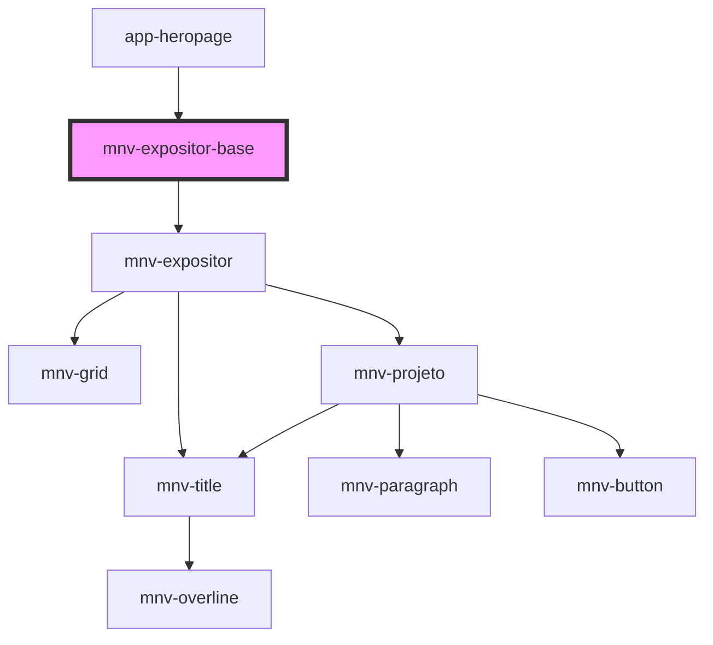

# mnv-expositor-base

<!-- Auto Generated Below -->

## Properties

| Property | Attribute | Description | Type  | Default     |
| -------- | --------- | ----------- | ----- | ----------- |
| `data`   | `data`    |             | `any` | `undefined` |

## Dependencies

### Used by

 - [app-heropage](..\..\..\app-pages\app-heropage)

### Depends on

- [mnv-expositor](..\mnv-expositor)

### Graph

----------------------------------------------

*Built with [StencilJS](https://stenciljs.com/)*
