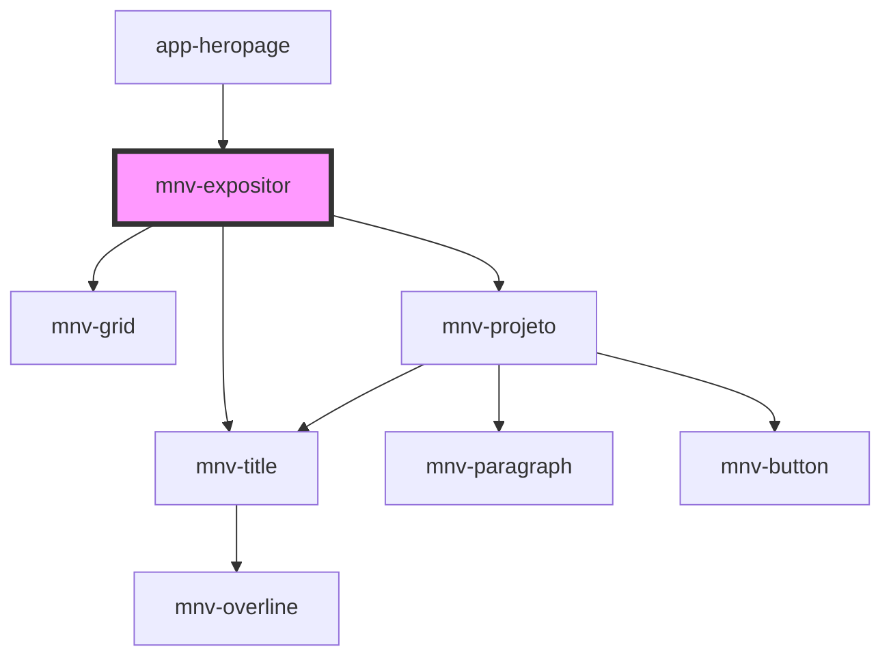

# mnv-expositor

<!-- Auto Generated Below -->

## Properties

| Property          | Attribute          | Description | Type     | Default            |
| ----------------- | ------------------ | ----------- | -------- | ------------------ |
| `projects`        | --                 |             | `any[]`  | `projects`         |
| `sectionImg`      | `section-img`      |             | `string` | `section.img`      |
| `sectionSubtitle` | `section-subtitle` |             | `string` | `section.subtitle` |
| `sectionTitle`    | `section-title`    |             | `string` | `section.title`    |

## Dependencies

### Used by

 - [app-heropage](../../../app-pages/app-heropage)

### Depends on

- [mnv-grid](../../../layout/mnv-grid)
- [mnv-title](../../../typography/mnv-title)
- [mnv-projeto](../mnv-projeto)

### Graph

----------------------------------------------

*Built with [StencilJS](https://stenciljs.com/)*
