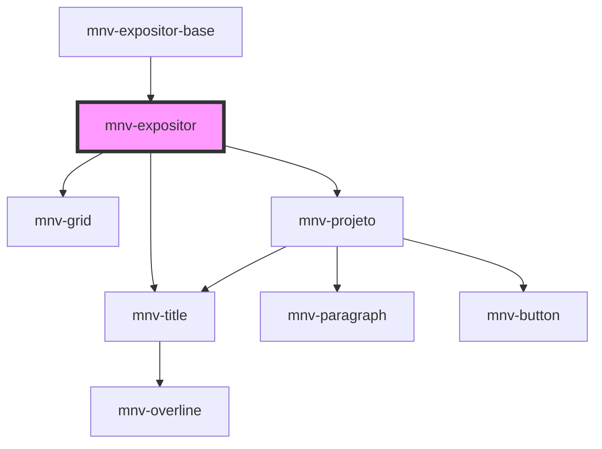

# mnv-expositor

<!-- Auto Generated Below -->

## Properties

| Property          | Attribute          | Description | Type     | Default     |
| ----------------- | ------------------ | ----------- | -------- | ----------- |
| `projects`        | `projects`         |             | `any`    | `undefined` |
| `sectionSubtitle` | `section-subtitle` |             | `string` | `undefined` |
| `sectionTitle`    | `section-title`    |             | `string` | `undefined` |
| `spotlight`       | `spotlight`        |             | `any`    | `undefined` |

## Dependencies

### Used by

 - [mnv-expositor-base](..\mnv-expositor-base)

### Depends on

- [mnv-grid](..\..\..\layout\mnv-grid)
- [mnv-title](..\..\..\typography\mnv-title)
- [mnv-projeto](..\mnv-projeto)

### Graph

----------------------------------------------

*Built with [StencilJS](https://stenciljs.com/)*
