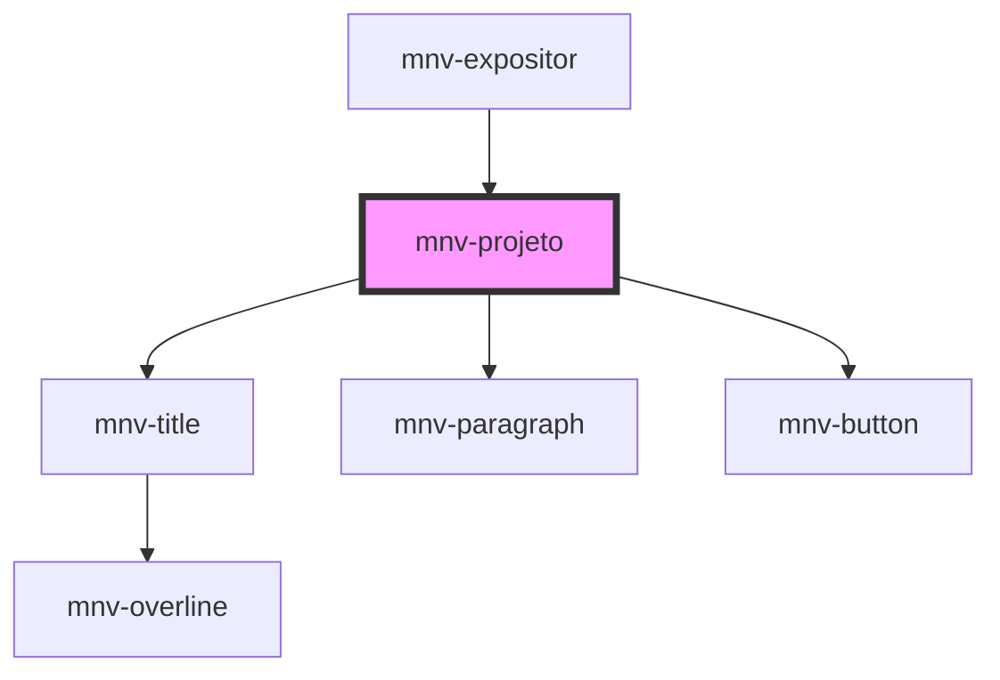

# mnv-projeto

<!-- Auto Generated Below -->

## Properties

| Property         | Attribute          | Description | Type     | Default                 |
| ---------------- | ------------------ | ----------- | -------- | ----------------------- |
| `projButton`     | `proj-button`      |             | `string` | `'More info'`           |
| `projButtonUrl`  | `proj-button-url`  |             | `string` | `undefined`             |
| `projImg`        | `proj-img`         |             | `string` | `undefined`             |
| `projImgLegenda` | `proj-img-legenda` |             | `string` | `'Image: Arthur Moaes'` |
| `projText`       | `proj-text`        |             | `string` | `'Text'`                |
| `projTitle`      | `proj-title`       |             | `string` | `'Title'`               |

## Dependencies

### Used by

 - [mnv-expositor](..\mnv-expositor)

### Depends on

- [mnv-title](..\..\..\typography\mnv-title)
- [mnv-paragraph](..\..\..\typography\mnv-paragraph)
- [mnv-button](..\..\..\inputs\mnv-button)

### Graph

----------------------------------------------

*Built with [StencilJS](https://stenciljs.com/)*
