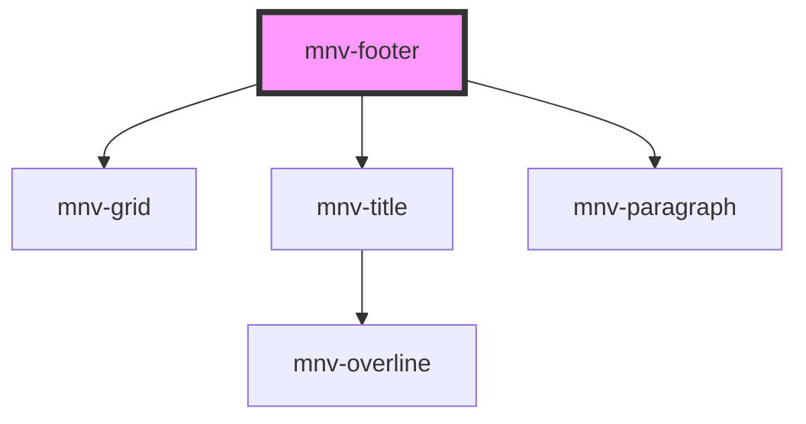

# mnv-footer

<!-- Auto Generated Below -->

## Properties

| Property    | Attribute | Description | Type          | Default     |
| ----------- | --------- | ----------- | ------------- | ----------- |
| `locations` | --        |             | `locations[]` | `undefined` |

## Dependencies

### Depends on

- [mnv-grid](../../layout/mnv-grid)
- [mnv-title](../../typography/mnv-title)
- [mnv-paragraph](../../typography/mnv-paragraph)

### Graph

----------------------------------------------

*Built with [StencilJS](https://stenciljs.com/)*
