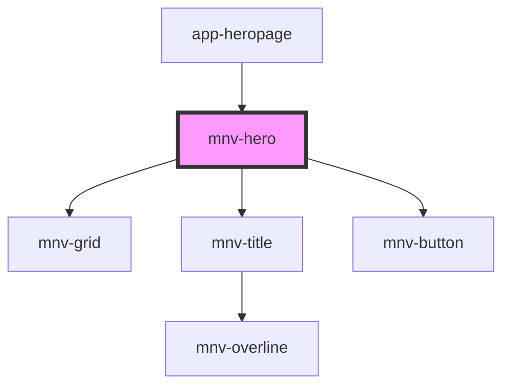

# mnv-hero

<!-- Auto Generated Below -->

## Properties

| Property     | Attribute    | Description | Type     | Default                                                                                                          |
| ------------ | ------------ | ----------- | -------- | ---------------------------------------------------------------------------------------------------------------- |
| `background` | `background` |             | `string` | `undefined`                                                                                                      |
| `bgimg`      | `bgimg`      |             | `string` | `'https://images.pexels.com/photos/373912/pexels-photo-373912.jpeg?auto=compress&cs=tinysrgb&dpr=2&h=650&w=940'` |
| `button`     | `button`     |             | `string` | `undefined`                                                                                                      |
| `herotitle`  | `herotitle`  |             | `string` | `undefined`                                                                                                      |

## Dependencies

### Used by

 - [app-heropage](..\..\app-pages\app-heropage)

### Depends on

- [mnv-grid](..\..\layout\mnv-grid)
- [mnv-title](..\..\typography\mnv-title)
- [mnv-button](..\..\inputs\mnv-button)

### Graph

----------------------------------------------

*Built with [StencilJS](https://stenciljs.com/)*
