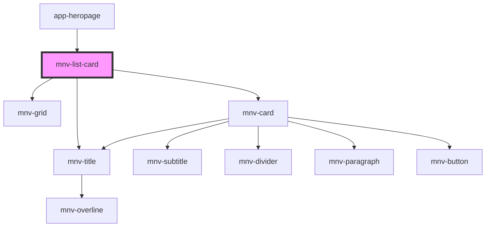

# mnv-list-card

<!-- Auto Generated Below -->

## Properties

| Property | Attribute | Description | Type     | Default     |
| -------- | --------- | ----------- | -------- | ----------- |
| `data`   | `data`    |             | `any`    | `undefined` |
| `name`   | `name`    |             | `string` | `undefined` |

## Dependencies

### Used by

 - [app-heropage](..\..\app-pages\app-heropage)

### Depends on

- [mnv-grid](..\..\layout\mnv-grid)
- [mnv-title](..\..\typography\mnv-title)
- [mnv-card](..\..\layout\mnv-card)

### Graph

----------------------------------------------

*Built with [StencilJS](https://stenciljs.com/)*
