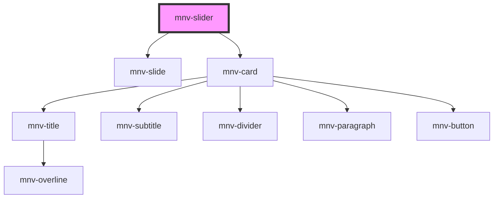

# mnv-slider

<!-- Auto Generated Below -->

## Properties

| Property         | Attribute         | Description | Type       | Default                                                                                                                                                                                                                                                                                                                                                                                                                                                                                                                                                                                                                                                                                                                                                                                                                                                                                                                                                                                                                                                                                                                                                           |
| ---------------- | ----------------- | ----------- | ---------- | ----------------------------------------------------------------------------------------------------------------------------------------------------------------------------------------------------------------------------------------------------------------------------------------------------------------------------------------------------------------------------------------------------------------------------------------------------------------------------------------------------------------------------------------------------------------------------------------------------------------------------------------------------------------------------------------------------------------------------------------------------------------------------------------------------------------------------------------------------------------------------------------------------------------------------------------------------------------------------------------------------------------------------------------------------------------------------------------------------------------------------------------------------------------- |
| `cards`          | --                |             | `any[]`    | `[ 		{ 			overline: 'Overline 1', 			cardtitle: 'Título 1', 			subtitle: 'Subtitle 1', 			maintext: 				'A Universidade Federal do Rio de Janeiro (UFRJ) é a maior federal do Brasil e a primeira instituição oficial de ensino superior do país, em atividade desde 1792 e organizada como estrutura universitária em 1920.', 			button: 'Button' 		}, 		{ 			overline: 'Overline 2', 			cardtitle: 'Título 2', 			subtitle: 'Subtitle 2', 			maintext: 'Main text message lorem ipsum', 			button: 'Button' 		}, 		{ 			overline: 'Overline 3', 			cardtitle: 'Título 3', 			subtitle: 'Subtitle 3', 			maintext: 'Main text message lorem ipsum', 			button: 'Button' 		}, 		{ 			overline: 'Overline 4', 			cardtitle: 'Título 4', 			subtitle: 'Subtitle 4', 			maintext: 'Main text message lorem ipsum', 			button: 'Button' 		}, 		{ 			overline: 'Overline 5', 			cardtitle: 'Título 5', 			subtitle: 'Subtitle 5', 			maintext: 'Main text message lorem ipsum', 			button: 'Button' 		}, 		{ 			overline: 'Overline 6', 			cardtitle: 'Título 6', 			subtitle: 'Subtitle 6', 			maintext: 'Main text message lorem ipsum', 			button: 'Button' 		} 	]` |
| `currentIndex`   | `current-index`   |             | `number`   | `0`                                                                                                                                                                                                                                                                                                                                                                                                                                                                                                                                                                                                                                                                                                                                                                                                                                                                                                                                                                                                                                                                                                                                                               |
| `height`         | `height`          |             | `number`   | `undefined`                                                                                                                                                                                                                                                                                                                                                                                                                                                                                                                                                                                                                                                                                                                                                                                                                                                                                                                                                                                                                                                                                                                                                       |
| `images`         | --                |             | `string[]` | `undefined`                                                                                                                                                                                                                                                                                                                                                                                                                                                                                                                                                                                                                                                                                                                                                                                                                                                                                                                                                                                                                                                                                                                                                       |
| `translateValue` | `translate-value` |             | `number`   | `0`                                                                                                                                                                                                                                                                                                                                                                                                                                                                                                                                                                                                                                                                                                                                                                                                                                                                                                                                                                                                                                                                                                                                                               |
| `width`          | `width`           |             | `number`   | `undefined`                                                                                                                                                                                                                                                                                                                                                                                                                                                                                                                                                                                                                                                                                                                                                                                                                                                                                                                                                                                                                                                                                                                                                       |

## Dependencies

### Depends on

- [mnv-slide](..\mnv-slide)
- [mnv-card](..\..\..\layout\mnv-card)

### Graph

----------------------------------------------

*Built with [StencilJS](https://stenciljs.com/)*
