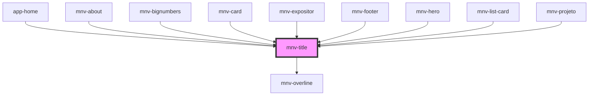

# mnv-title

<!-- Auto Generated Below -->

## Properties

| Property   | Attribute  | Description | Type      | Default     |
| ---------- | ---------- | ----------- | --------- | ----------- |
| `level`    | `level`    |             | `string`  | `undefined` |
| `overline` | `overline` |             | `string`  | `undefined` |
| `white`    | `white`    |             | `boolean` | `undefined` |

## Dependencies

### Used by

 - [app-home](../../app-pages/app-home)
 - [mnv-about](../../sections/mnv-about)
 - [mnv-bignumbers](../../sections/mnv-bignumbers)
 - [mnv-card](../../layout/mnv-card)
 - [mnv-expositor](../../sections/expositor/mnv-expositor)
 - [mnv-footer](../../sections/mnv-footer)
 - [mnv-hero](../../sections/mnv-hero)
 - [mnv-list-card](../../sections/mnv-list-card)
 - [mnv-projeto](../../sections/expositor/mnv-projeto)

### Depends on

- [mnv-overline](../mnv-overline)

### Graph

----------------------------------------------

*Built with [StencilJS](https://stenciljs.com/)*
