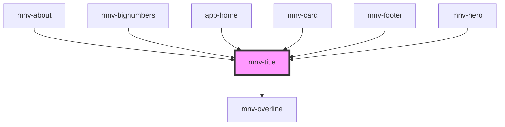

# mnv-title

<!-- Auto Generated Below -->

## Properties

| Property   | Attribute  | Description | Type     | Default     |
| ---------- | ---------- | ----------- | -------- | ----------- |
| `level`    | `level`    |             | `string` | `undefined` |
| `overline` | `overline` |             | `string` | `undefined` |

## Dependencies

### Used by

- [mnv-about](....\sections\mnv-about)
- [mnv-bignumbers](....\sections\mnv-bignumbers)
- [app-home](....\app-pages\app-home)
- [mnv-card](....\layout\mnv-card)
- [mnv-footer](....\layout\mnv-footer)
- [mnv-hero](....\layout\mnv-hero)

### Depends on

- [mnv-overline](..\mnv-overline)

### Graph

---

_Built with [StencilJS](https://stenciljs.com/)_
